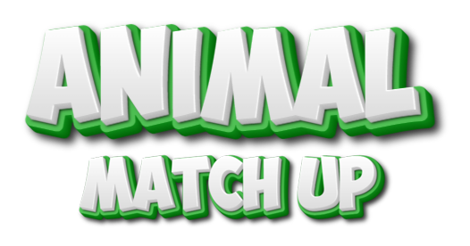
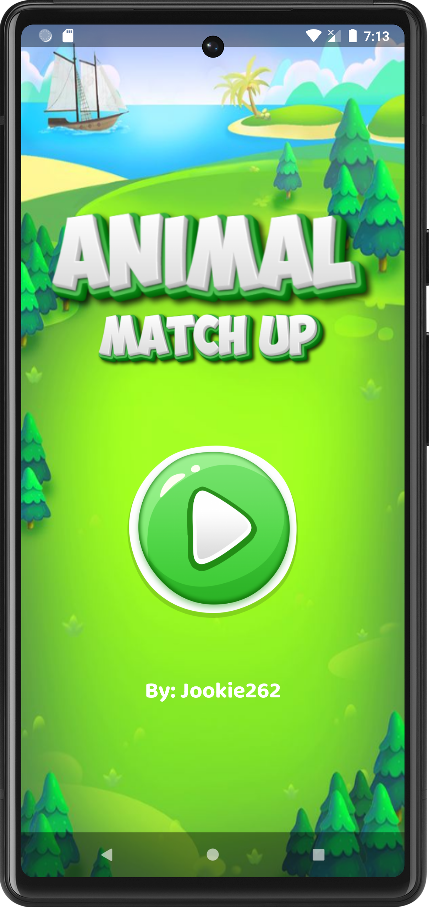

<h4 align=center>
    
     
    <b> A Task Performance in Mobile App that aims to develop a simple mobile game like memory game. </b>
</h4>

## **Description** 🔥
Develop a simple mobile game similar to Oliver Kocsis' Match Up. Create and use at least one (1) style. In this game, all cards are first laid face down on a surface and two (2) cards are flipped face up over each turn. The object of the game is to turn over pairs of matching cards. The game ends when the
last pair has been picked up.

## **Scoring** 💯
The scoring system in the game is straightforward: correctly guessing a pair awards an additional 10 points, while an incorrect guess results in a deduction of 5 points.
| Correct | Wrong |
| :---:   | :---: | 
| + 10 points | -5 points |

## **Screen Shots** 📷

	
	
	
	
	
	

## **Video** 🎥
https://github.com/Jookie262/animal-match-up/assets/62915062/844c26a8-14ed-4787-804c-a985e8c1e07d

## **Special Thanks** 💖
We would like to express my sincere appreciation to Wajahat Karim (author of [EasyFlipView](https://github.com/wajahatkarim3/EasyFlipView)) for providing me with the incredible EasyFlipView library. It has been instrumental in making my simple project a success and adding an engaging flipping animation to my application.
						 
## **Contribution** 🔥
If you wish to help improve this project, fork this repo and submit your own pull request. If you discover a problem with this project, please report it to the issue page. Thank you very much   😊.

## **Thank you** 💖
If you like this project just click ⭐ and share it with others.
